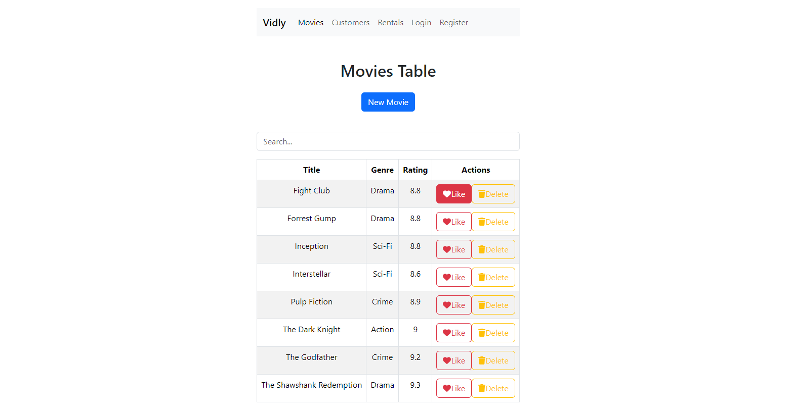

# Movies Table

### About:
A multipage application for managing a movie list, allowing users to add, delete, find and mark favorite movies. It includes login and registration sections with input data validation, implemented through a custom hook called useValidate. This ensures a secure and efficient user experience for managing movie collections.

### Demo:

### Technologies Used:

### Packages Used:
- [React Router DOM](https://www.npmjs.com/package/react-router-dom)
- [Joi Browser](https://www.npmjs.com/package/joi-browser)
- [Lodash](https://www.npmjs.com/package/lodash)
- [Use Local Storage](https://www.npmjs.com/package/use-local-storage?activeTab=readme)
- [Icons](https://www.npmjs.com/package/@fortawesome/react-fontawesome) 

